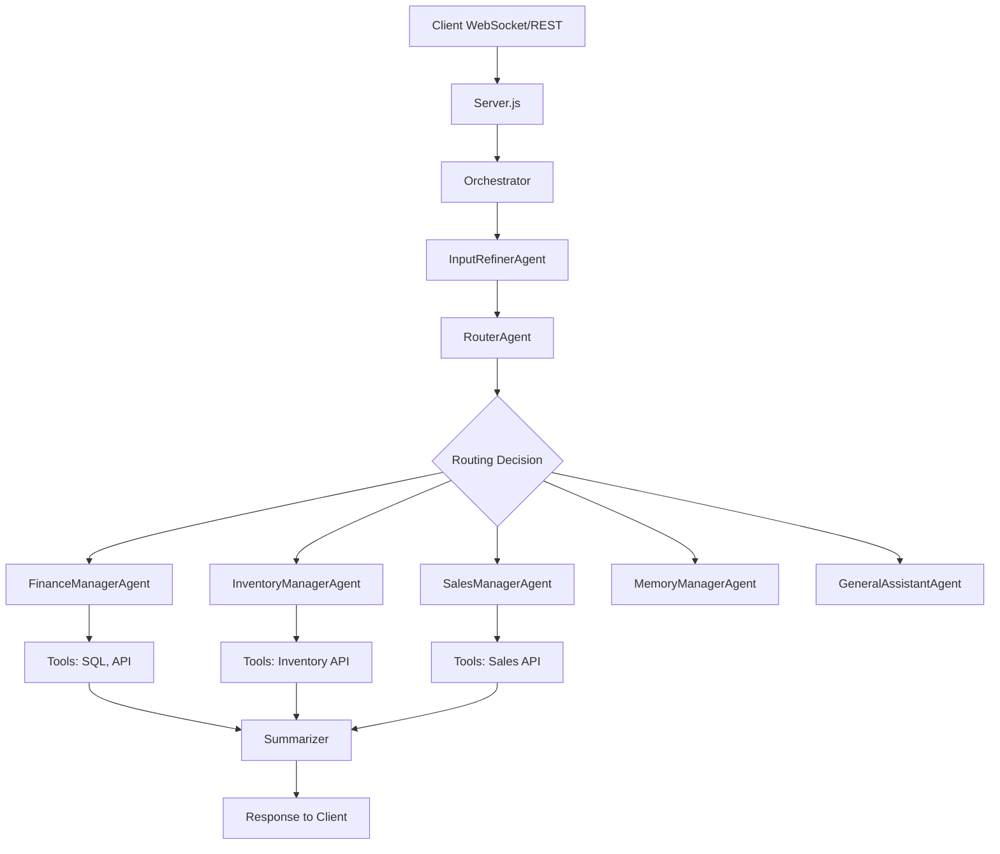

# Lucky Tech Multi-Agent System - Application Specification

**Version**: 2.0.0  
**Last Updated**: 2026-01-09  
**Status**: Production Ready

---

## 📋 Table of Contents

1. [System Overview](#system-overview)
2. [Architecture](#architecture)
3. [Agents Specification](#agents-specification)
4. [Tools & Capabilities](#tools--capabilities)
5. [Data Flow](#data-flow)
6. [API Specification](#api-specification)
7. [Configuration](#configuration)
8. [Deployment](#deployment)
9. [Troubleshooting](#troubleshooting)

---

## System Overview

### Purpose
Multi-Agent AI system untuk Lucky Tech Group yang menangani query bisnis terkait Finance, Inventory, dan Sales dengan intelligent routing dan specialized processing.

### Key Features
- ✅ **Intelligent Routing**: Auto-detect user intent dan route ke specialist agent
- ✅ **Input Refinement**: Auto-correct typo & grammar sebelum processing
- ✅ **Multi-Specialist**: Finance, Inventory, Sales, Memory, General Assistant
- ✅ **Dynamic Data**: Real-time query ke PostgreSQL via backend API
- ✅ **Multi-Tenant**: Support multiple tenant schemas
- ✅ **Session Management**: Redis-based session persistence
- ✅ **Qwen Integration**: Utilize Qwen CLI for AI processing

### Technology Stack
- **Runtime**: Node.js 22.x (ES Modules)
- **AI Engine**: Qwen CLI (qwen-coder-plus, Gemini Flash)
- **Database**: PostgreSQL (via backend API)
- **Cache**: Redis
- **Backend API**: Go (ltech-backend)
- **Process Manager**: PM2
- **Protocol**: WebSocket + REST API

---

## Architecture

### High-Level Architecture



### Pipeline Flow

```
User Input
    ↓
[Step 0] InputRefinerAgent (Typo Correction)
    ↓
[Step 1] RouterAgent (Intent Detection)
    ↓
[Step 2] Specialist Agent (Finance/Inventory/Sales)
    ↓
[Step 3] SummarizerAgent (Format Response)
    ↓
Final Response
```

### Directory Structure

```
ai/multi-agent-final/
├── agents/               # All agent implementations
│   ├── router/          # Routing agent
│   ├── finance-manager/ # Finance specialist
│   ├── inventory-manager.js # Inventory specialist
│   ├── sales-manager.js
│   ├── memory-manager.js
│   ├── general-assistant.js
│   ├── input-refiner.js # NEW: Typo correction
│   └── summarizer.js
├── core/                # Core system components
│   ├── orchestrator.js  # Main pipeline coordinator
│   ├── session-manager.js
│   ├── memory-manager.js
│   └── tools/          # Shared tools
│       ├── inventory-tool.js
│       ├── price-config-tool.js # NEW
│       ├── stock-report-tool.js
│       ├── saldo-kas-tool.js
│       └── ...
├── tools/              # SQL templates
│   ├── finance/
│   └── inventory/
├── server.js           # WebSocket & HTTP server
├── .env               # Configuration
├── package.json
└── docs/              # Documentation
    ├── APPLICATION_SPEC.md (this file)
    └── INPUT_REFINER_AGENT.md
```

---

## Agents Specification

### 1. InputRefinerAgent (NEW)

**Purpose**: Pre-process user input untuk fix typo dan grammar sebelum masuk pipeline.

**Capabilities**:
- Qwen-powered typo correction
- Grammar normalization
- Similarity-based change detection (99% threshold)
- Automatic fallback to original on error

**Performance**:
- Accuracy: 100% (tested)
- Average Latency: 3.4 seconds
- Success Rate: 10/10 test cases

**Configuration**:
```javascript
{
    enabled: true,
    minSimilarity: 0.99,
    timeout: 10000 // ms
}
```

**Example**:
```
Input:  "tampilkan brg dengan perk fukuyama"
Output: "tampilkan barang dengan merk fukuyama"
```

### 2. RouterAgent

**Purpose**: Analyze user intent dan route ke specialist agent yang sesuai.

**Capabilities**:
- Intent detection menggunakan Qwen
- Confidence scoring
- Session continuity management
- Fallback to general-assistant

**Routing Rules**:
- Finance keywords → `finance-manager`
- Inventory keywords → `inventory-manager`
- Sales keywords → `sales-manager`
- Memory keywords → `memory-manager`
- Default → `general-assistant`

**Response**:
```javascript
{
    targetAgent: 'inventory-manager',
    confidence: 0.95,
    userIntent: 'Search products by brand',
    qwenSessionId: 'uuid-string'
}
```

### 3. FinanceManagerAgent

**Purpose**: Specialist untuk financial queries (Neraca, Laba Rugi, Saldo Kas, dll).

**Capabilities**:
- SQL-based financial reports (Neraca, Laba Rugi)
- API-based real-time queries (Saldo Kas, Buku Besar)
- Trend analysis
- Period comparison

**Tools**:
- `SaldoKasTool`: Query cash balances
- `BukuBesarTool`: General ledger
- SQL templates untuk Neraca/Laba Rugi

**Example Queries**:
- "tampilkan neraca bulan ini"
- "berapa saldo kas hari ini"
- "laba rugi tahun 2025"

### 4. InventoryManagerAgent

**Purpose**: Specialist untuk inventory management.

**Capabilities**:
- Product search dengan dynamic fields
- Master data lookup (brand, category)
- Stock reports
- Stock movement analysis
- Typo normalization (local + InputRefiner)
- **Dynamic Price Configuration** (NEW)

**Tools**:
- `InventoryTool`: Search, detail, lookup, procurement, aging, trend
- `PriceConfigTool`: Dynamic price field config (NEW)
- `StockReportTool`: Stock analysis
- `StockMovementTool`: Mutation tracking

**Dynamic Features**:
- Smart field selection based on query
- Master data ID lookup before filtering
- Price field visibility control (`publik` flag)
- Dynamic price labels dari database

**Example Queries**:
- "cari barang merk fukuyama"
- "tampilkan harga eceran motor matic"
- "stok barang yang kosong"
- "detail barang ID 12345"

### 5. SalesManagerAgent

**Purpose**: Specialist untuk sales queries.

**Capabilities**:
- Sales analysis
- Customer insights
- Transaction history

**Tools**:
- Sales API integration

### 6. SummarizerAgent

**Purpose**: Format final response untuk user.

**Capabilities**:
- Markdown formatting
- Data table generation
- **Direct data bypass** untuk structured data
- Voice-optimized summaries

**Output Format**:
```
[VISUAL]
Markdown formatted response
[/VISUAL]

[VOICE]
Voice-friendly summary
[/VOICE]

[[DATA]]
{JSON structured data}
[[/DATA]]
```

---

## Tools & Capabilities

### InventoryTool

**Operations**:
1. **search**: Search products dengan filters
2. **detail**: Get product details by ID
3. **lookup**: Query master data (merk, kategori, dll)
4. **procurement**: Suggest re-order
5. **aging**: Dead stock analysis
6. **trend**: Trend analysis

**Filters Supported**:
- `idmerk`, `idkategori`, `idlokasi`
- `idgol`, `idjenis`
- `rak` (shelf location)
- `search` (text search)

**API Endpoint**: `/api/inventory/barang`

### PriceConfigTool (NEW)

**Purpose**: Fetch dynamic price field configuration dari `[tenant].harga`.

**Response Structure**:
```javascript
{
    fields: {
        jual1: { kode: 'JUAL1', nama: 'List', publik: true },
        jual2: { kode: 'JUAL2', nama: 'Partai', publik: true },
        // ...
    },
    publicFields: ['jual1', 'jual2', 'jual3'],
    labels: {
        jual1: 'List',
        jual2: 'Partai',
        jual3: 'Sales'
    },
    labelToField: {
        'list': 'jual1',
        'partai': 'jual2',
        'sales': 'jual3'
    }
}
```

**Caching**: In-memory cache per schema

**API Endpoint**: `/api/inventory/harga`

### StockReportTool

**Purpose**: Analyze stock across locations.

**Data Source**: `[tenant].s` table

---

## Data Flow

### Request Flow (with InputRefiner)

```
1. User sends: "tampilkan brg dengan perk fukuyama"
   ↓
2. InputRefinerAgent: 
   - Calls Qwen for correction
   - Output: "tampilkan barang dengan merk fukuyama"
   ↓
3. RouterAgent:
   - Receives corrected input
   - Routes to: inventory-manager
   ↓
4. InventoryManagerAgent:
   - Loads price config (if needed)
   - Performs master lookup: "fukuyama" → ID 146
   - Searches with: idmerk=146
   ↓
5. SummarizerAgent:
   - Formats results
   - Generates markdown + JSON
   ↓
6. Client receives formatted response
```

### Session Flow

```
1. Client connects → Redis session created
2. Each query → Update session context
3. Qwen session ID tracked per user
4. Memory context loaded on each request
5. Session persists across reconnects
```

---

## API Specification

### WebSocket API

**Connection**: `ws://localhost:8899`

**Message Format**:
```javascript
{
    type: 'message',
    content: 'user query here',
    sessionId: 'optional-session-id',
    tenantSchema: 'required-tenant-schema',
    userId: 'user-id',
    userRole: 'user'
}
```

**Response Events**:
```javascript
{
    type: 'progress',
    data: {
        step: 'refining|routing|thinking|summarizing',
        message: 'Status message'
    }
}

{
    type: 'response',
    data: {
        success: true,
        response: {
            summary: 'Markdown response',
            data: { /* structured data */ },
            metadata: { /* meta info */ }
        }
    }
}
```

### REST API

**Endpoint**: `POST /api/query`

**Request**:
```javascript
{
    message: 'user query',
    tenantSchema: 'schema_name',
    userId: 'user-id',
    userRole: 'user',
    sessionId: 'optional'
}
```

**Response**:
```javascript
{
    success: true,
    response: {
        summary: 'Response text',
        data: { /* structured data */ }
    },
    metadata: {
        agent: 'agent-name',
        latency: 1234,
        qwenSessionId: 'uuid'
    }
}
```

---

## Configuration

### Environment Variables

```bash
# Backend API
BACKEND_API_URL=https://erp.luckyjaya.tech/api
AI_SPECIAL_TOKEN=your-secret-token

# Redis
REDIS_URL=redis://localhost:6379
REDIS_PASSWORD=

# Server
PORT=8899
NODE_ENV=production

# Qwen (system-level, configured via qwen CLI)
# No env vars needed - uses qwen CLI globally
```

### Agent Configuration

Each agent can be configured via constructor options:

```javascript
const inputRefiner = new InputRefinerAgent();
inputRefiner.setEnabled(true);  // Enable/disable
inputRefiner.minSimilarity = 0.99;  // Threshold
```

---

## Deployment

### Prerequisites

```bash
# Install dependencies
npm install

# Ensure Qwen CLI is installed and configured
qwen --version

# Ensure Redis is running
redis-cli ping

# Ensure backend API is accessible
curl https://erp.luckyjaya.tech/api/health
```

### PM2 Deployment

```bash
# Start
pm2 start ecosystem.config.js --name multi-agent-final

# Restart
pm2 restart multi-agent-final

# Logs
pm2 logs multi-agent-final --lines 50

# Monitor
pm2 monit
```

### Health Check

```bash
# Check service
curl http://localhost:8899/api/health

# Expected response
{"status":"ok","service":"ltech-multi-agent","version":"2.0.0"}
```

---

## Troubleshooting

### Common Issues

**1. InputRefiner Timeout**
```
Symptom: "Qwen timeout after 10s"
Solution: Check Qwen CLI availability, increase timeout in input-refiner.js
```

**2. Price Config Error**
```
Symptom: "Invalid response from harga endpoint"
Solution: Check tenant schema has harga table, verify backend API
```

**3. Session Lost**
```
Symptom: "Session not found in Redis"
Solution: Redis may have restarted, session auto-recovers with new ID
```

**4. Agent Not Found**
```
Symptom: "Unknown agent: xyz"
Solution: Check agent is registered in orchestrator.js AGENTS object
```

### Debug Mode

Enable detailed logging:
```javascript
// In orchestrator.js
log.level = 'debug';
```

Monitor logs:
```bash
pm2 logs multi-agent-final --lines 100 --err --out
```

---

## Performance Metrics

### Latency Breakdown (Average)

- InputRefiner: **3.4s**
- Router: **2.5s**
- Specialist (Inventory): **1.2s**
- Summarizer: **0.5s**
- **Total**: **~7.6s** per query

### Optimization Tips

1. **Disable InputRefiner** for known-clean inputs
2. **Use session resume** to reduce Qwen init overhead
3. **Cache price config** (already implemented)
4. **Batch queries** when possible

---

## Future Roadmap

- [ ] Add Gemini Flash support for InputRefiner (faster)
- [ ] Implement request caching layer
- [ ] A/B testing for correction quality
- [ ] Metrics dashboard (Grafana)
- [ ] Multi-language support
- [ ] Voice input support

---

**Document Version**: 1.0  
**Author**: AI Development Team  
**Contact**: Lucky Tech Group
